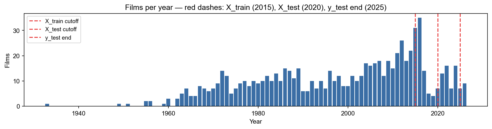
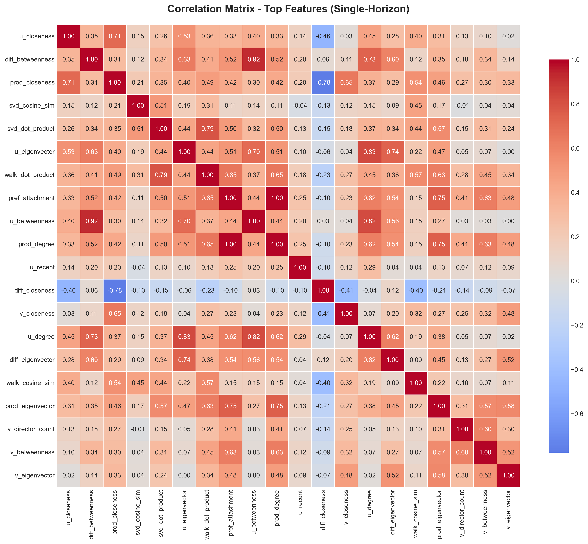
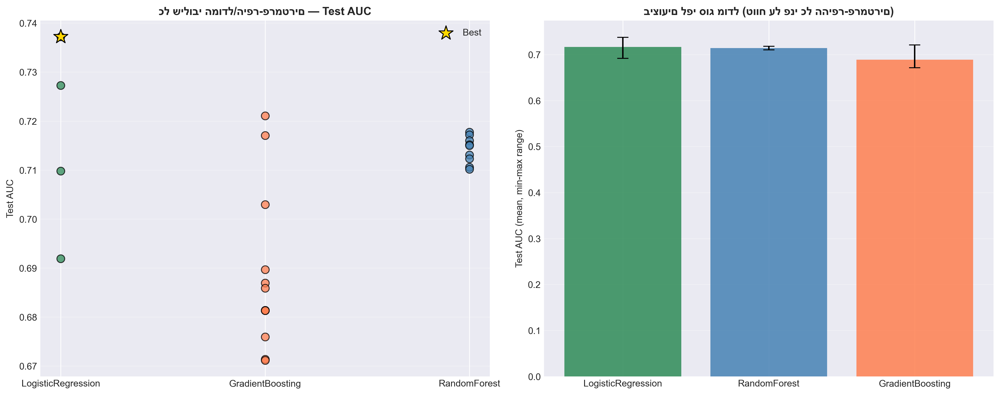
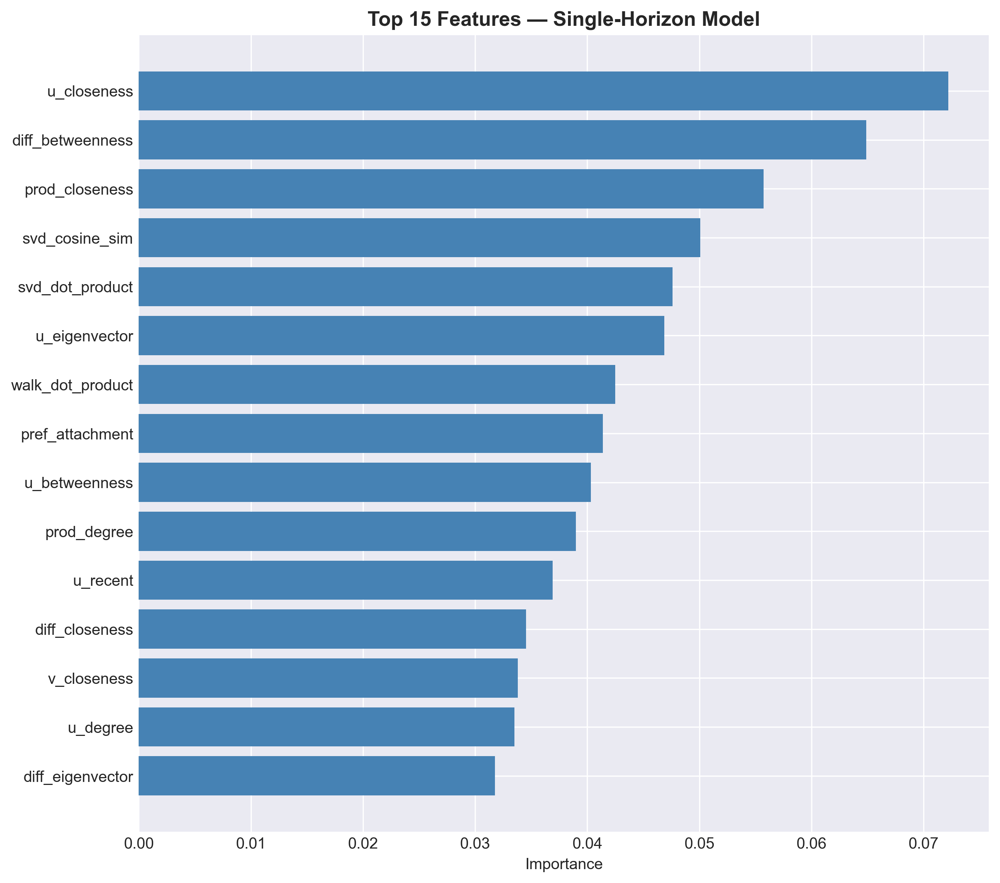
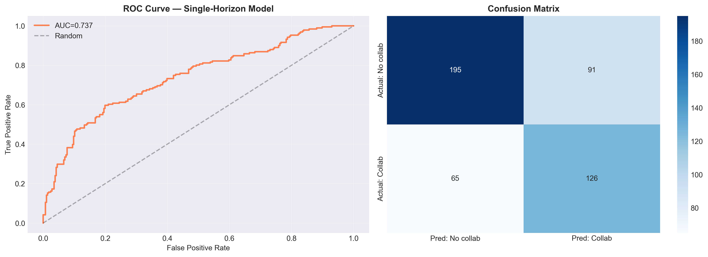
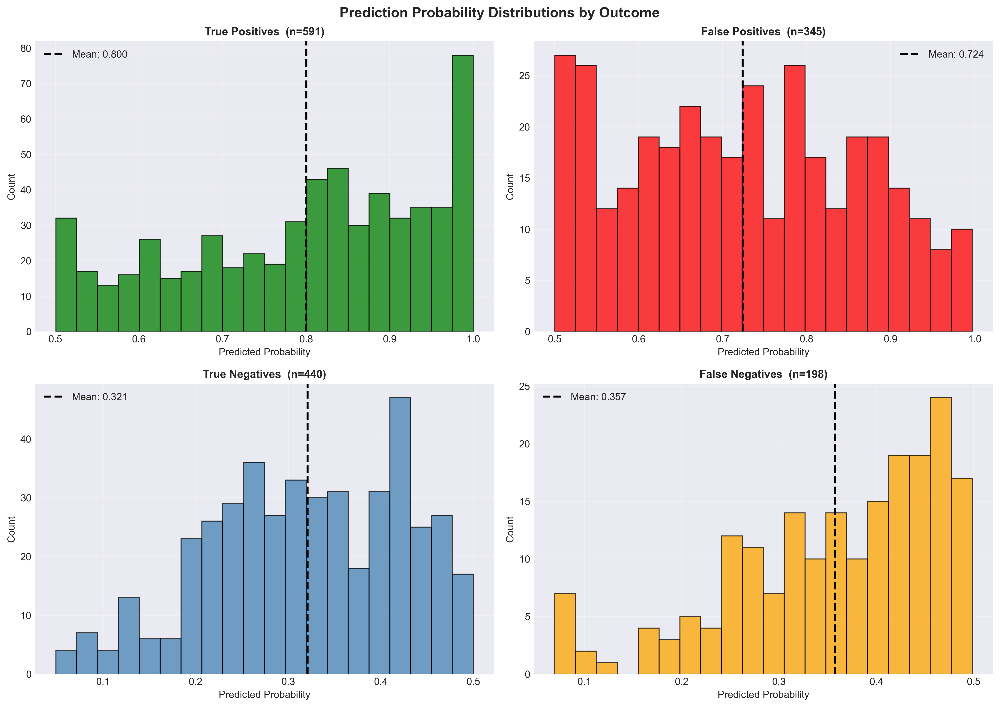
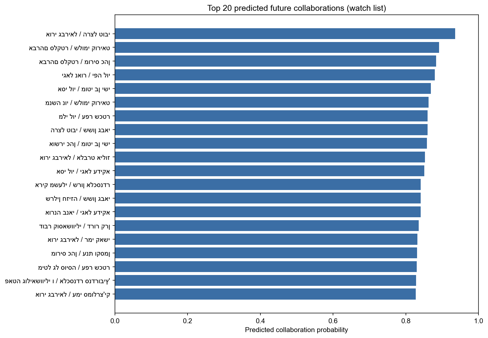

# ניתוח גרף שיתופי הפעולה של הקולנוע הישראלי וניבוי קשרים עתידיים
## דוח מחקר — למידת מכונה על גרפים

---

## מבוא

### רקע והמטרה

תעשיית הקולנוע הישראלית עברה שינויים עמוקים לאורך עשרות שנים — ממספר מצומצם של סרטים בשנות ה-30, דרך גל הסרטים הפופולריים של שנות ה-70 וה-80, ועד לתעשייה ענפה ומגוונת במאה ה-21. מאחורי כל סרט עומד רשת של שיתופי פעולה בין שחקנים, ורשת זו מסתירה מידע רב על הדינמיקה של התעשייה: מי הם "גשרי הכוכבים" המחברים בין ז'אנרים שונים? אילו קהילות שחקנים עובדות יחד שוב ושוב? ובפרט — האם ניתן לחזות מראש אילו שחקנים ישתפו פעולה בעתיד?

מחקר זה מציג ניתוח מקיף של גרף שיתופי הפעולה בין שחקנים ישראלים, הנבנה על בסיס נתוני ויקיפדיה לשנים 1933–2026. המחקר כולל שלושה צירים מרכזיים:

1. **ניתוח מבנה הגרף לאורך הזמן** — כיצד צמחה הרשת, אילו מדדי מרכזיות מאפיינים שחקנים מרכזיים, ואילו קהילות טבעיות קיימות בתוך התעשייה
2. **זיהוי שחקנים מרכזיים** — על-פי מדדים גרפיים: מספר שיתופי פעולה, תפקיד כ"גשר" בין קהילות, ומיקום מרכזי ברשת
3. **ניבוי קשרים עתידיים (Link Prediction)** — בניית מודל Machine Learning המחשב פיצ'רים גרפיים ומנבא אילו שחקנים ישתפו פעולה ב-5 השנים הבאות, עם הערכה מול נתוני אמת שנאספו בפועל (2021–2025)

### חשיבות המחקר

גרפי שיתופי פעולה בתעשיות יצירה מהווים מקרה בוחן מעניין לתיאוריית הגרפים ולמידת מכונה: הם גדולים מספיק כדי לדרוש כלים מתמטיים, אך מספיק ממוקדים כדי שניתן לאמת ניבויים מול מציאות ידועה. ניבוי שיתופי פעולה עתידיים רלוונטי לחברות הפקה, סוכנויות קאסטינג וחוקרי תרבות כאחד.

### מבנה הדוח

הדוח מחולק לארבעה חלקים: שיטות (איסוף נתונים, בניית הגרף, פיצ'רים), תוצאות (ניתוח גרף, קהילות, מרכזיות, ניבוי), תובנות ומסקנות, ומגבלות המחקר.

---

## שיטות

### איסוף נתונים

**מקור הנתונים:** כל הנתונים נאספו מויקיפדיה העברית באמצעות web scraping ייעודי. עבור כל סרט קולנוע ישראלי שנמצא בויקיפדיה, נאספו: שם הסרט, שנת יציאה, רשימת שחקנים, ז'אנר וכיוונאי. השחקנים זוהו לפי קישור ויקיפדיה ייחודי (slug) או לפי שם מלא במקרה שאין דף ויקיפדיה.

**מגבלות הנתונים שזוהו:** כ-14% משורות ה-cast (כ-25% מהשחקנים) אינם מופיעים בויקיפדיה עם עמוד מלא. לכן כל הניתוח מתבצע על בסיס מזהה אחיד (`actor_id`) המשלב את ה-slug עם שם השחקן במקרים חסרים. בנוסף, נמצא שכיסוי ויקיפדיה אינו מלא: בבדיקה ידנית של מספר מקרים, נמצאו שיתופי פעולה שהתרחשו בפועל אך אינם מיוצגים בנתונים (למשל, שיתופי פעולה בסדרות טלוויזיה, או שמות שחקנים החסרים מדפי הסרטים). מגבלה זו גורמת להערכת-חסר של ביצועי המודל.

**גודל מדגם סופי:**

| מדד | ערך |
|-----|-----|
| סה"כ שורות cast | 2,972 |
| סרטים ייחודיים | 759 |
| שחקנים ייחודיים | ~1,399 |
| טווח שנים | 1933–2026 |



### בניית הגרף

הגרף בנוי כגרף לא-מכוון ולא-ממושקל. **צמתים** הם שחקנים; **קשתות** מייצגות שיתוף פעולה בסרט אחד לפחות. שני שחקנים מחוברים בקשת אם הופיעו יחד לפחות בסרט אחד בתקופת הזמן המוגדרת.

לצורך ניתוח עיתי, הגרף נבנה בגרסאות שונות:

| גרף | תקופה | צמתים | קשתות |
|-----|--------|-------|-------|
| תקופה A (מוקדמת) | עד ~1980 | 132 | 472 |
| תקופה B (ביניים) | עד ~2000 | 335 | 930 |
| תקופה C (מודרנית) | עד 2020 | 1,106 | 4,731 |
| G_full_2020 (היסטורי מלא) | 1918–2020 | 1,125 | 3,999 |
| G_full_latest (עדכני) | 1918–2026 | 1,399 | 6,092 |
| G_1990_2010 (Train) | 1990–2010 | 443 | 1,053 |
| G_1990_2015 (Test) | 1990–2015 | 691 | 1,907 |

### אלגוריתמים וכלים

**שפה וספריות:** Python 3, NetworkX ≥3.5 לבניית הגרף, scikit-learn לאימון המודלים, pandas/numpy לניהול נתונים, matplotlib/seaborn לויזואליזציה.

**מדדי מרכזיות שחושבו:**

- **Degree Centrality** — מספר שכנים מנורמל; מייצג פעילות שיתופית כוללת
- **Betweenness Centrality** — שבר הנתיבים הקצרים ביותר העוברים דרך הצומת; מייצג תפקיד "גשרי" בין קהילות
- **Closeness Centrality** — ממוצע המרחקים ההפוכים מהצומת לכל הצמתים; מייצג נגישות לרשת הכוללת
- **Eigenvector Centrality** — משקל שמבוסס על חשיבות השכנים; מייצג "מרכזיות-של-מרכזיות"

**זיהוי קהילות:** שימוש בשלושה אלגוריתמים — Louvain, Girvan-Newman, ו-Label Propagation — והשוואת תוצאותיהם. אלגוריתם Louvain שימש בסופו של דבר כאלגוריתם הראשי בשל ביצועיו המיטביים ויציבות התוצאות.

### פיצ'רים למודל ניבוי הקשרים

לכל **זוג שחקנים** (u, v) חושבו 42 פיצ'רים מחמישה סוגים:

**1. פיצ'רים טופולוגיים (5):**
- `common_neighbors` — שכנים משותפים
- `jaccard` — מדד Jaccard על שכנים
- `adamic_adar` — מדד Adamic-Adar
- `pref_attachment` — Preferential Attachment
- `shortest_path` — אורך הנתיב הקצר ביותר

**2. פיצ'רי מרכזיות (16):**
עבור כל שחקן (u, v) בנפרד: degree, betweenness, closeness, eigenvector, וגם מכלולים (הפרש, מכפלה) — 8 מדדים × 2 שחקנים = 16

**3. פיצ'רים זמניים (10):**
- אורך הקריירה (שנים), מספר סרטים, שנת הסרט הראשון/האחרון, חפיפת קריירה בין u ל-v, האם השחקן פעיל לאחרונה (5 שנים), סטטוס חיים (לפי נתוני פטירה)

**4. פיצ'רי ז'אנר ובמאי (7):**
- מספר ז'אנרים משותפים, אם הז'אנר הראשי זהה, גיוון ז'אנרי של כל שחקן, מספר במאים משותפים, מספר במאים של כל שחקן

**5. Embeddings (4):**
- **SVD (Matrix Factorization):** פירוק ערכים סינגולריים על מטריצת הסמיכות, 32 ממדים — cosine similarity ו-dot product
- **Walk-based Embedding:** אלגוריתם random walk מבוסס Node2Vec (ללא gensim, בממוש פנימי) — cosine similarity ו-dot product



---

## תוצאות

### ניתוח התפתחות הגרף לאורך הזמן

#### גדילה היסטורית

הגרף צמח באופן עקבי אך לא ליניארי לאורך השנים. מדדים מרכזיים לפי תקופה:

| מדד | תקופה A (מוקדמת) | תקופה B (ביניים) | תקופה C (מודרנית) |
|-----|------|------|------|
| מספר שחקנים | 132 | 335 | 1,106 |
| מספר שיתופי פעולה | 472 | 930 | 4,731 |
| צפיפות (density) | 0.055 | 0.017 | 0.008 |
| ממוצע Clustering | 0.742 | 0.659 | 0.751 |
| מספר שכנים ממוצע | 7.15 | 5.55 | 8.56 |
| מקסימום שכנים | 34 | 48 | 62 |
| גודל רכיב קשיר עיקרי | 128 (97%) | 289 (86%) | 989 (89%) |
| קוטר | 6 | 6 | 9 |

**ממצאים מרכזיים:**

- **צפיפות יורדת עם הזמן:** כאשר הגרף גדל, הצפיפות יורדת מ-5.5% ל-0.8%. זוהי תופעה נורמלית ברשתות ריאליות — מספר הקשרים גדל אך לא בריבוע מספר השחקנים.
- **Clustering גבוה ויציב:** מקדם ה-Clustering נשאר גבוה (0.66–0.75) בכל התקופות, מה שמעיד על מבנה "עולם קטן" (Small World) — הקולנוע הישראלי מחולק לקבוצות הדוקות שיש ביניהן גשרים.
- **רכיב קשיר עיקרי:** כ-86–97% מהשחקנים שייכים לרכיב הגדול, מה שמעיד על רשת מחוברת היטב.
- **גדילה מואצת:** מתקופה B לתקופה C, מספר הקשרים גדל פי 5 (930 → 4,731), לעומת גדילת פי 3.3 בשחקנים (335 → 1,106) — כל שחקן חדש מייצר יותר שיתופי פעולה בממוצע.

#### מאפייני "עולם קטן"

ברשתות "עולם קטן" (Small-World Networks), הקוטר (מרחק מקסימלי) קטן ביחס לגודל הגרף. בגרף שלנו, בתקופה C: קוטר=9 עם 1,106 צמתים — כלומר ניתן להגיע מכל שחקן לכל שחקן אחר בלא יותר מ-9 "דרגות הפרדה".

---

### ניתוח קהילות

#### שיטה ותוצאות כלליות

אלגוריתם Louvain זיהה **68 קהילות** בגרף הכולל. פיזור הגדלים אינו אחיד — רוב הקהילות קטנות (חציון: 3 שחקנים), אך ישנן מספר קהילות גדולות:

| דירוג | גודל הקהילה |
|-------|------------|
| 1 | 135 שחקנים |
| 2 | 78 שחקנים |
| 3 | 74 שחקנים |
| 4 | 66 שחקנים |
| 5 | 64 שחקנים |
| 6 | 62 שחקנים |
| 7 | 59 שחקנים |
| 8 | 58 שחקנים |

#### פרשנות הקהילות

הקהילות הגדולות מייצגות "מעגלי קאסטינג" — קבוצות של שחקנים שעובדים שוב ושוב עם אותם במאים, בז'אנרים דומים, ובתקופת זמן חופפת. ניתן לזהות מספר דפוסים אופייניים:

- **קהילות ז'אנריות:** שחקנים הממוקדים בקומדיות עממיות, דרמות פסיכולוגיות, סרטי אקשן — לרוב מהווים קבוצה נפרדת.
- **קהילות תקופתיות:** שחקנים שהיו פעילים בעיקר בשנות ה-80-90 יוצרים קהילות נפרדות משחקנים שהתחילו לעבוד אחרי 2010.
- **קהילות "גיאוגרפיות":** שחקנים מהתיאטרון לאומי, הבימה, לעומת שחקנים שבאים מרקע של סרטי עלייה ופריפריה.

הקהילה הגדולה ביותר (135 שחקנים) מייצגת כנראה את "הגרעין הקשה" של הקולנוע הישראלי המודרני — שחקנים ותיקים ופעילים שעבדו עם מגוון רחב של במאים ובז'אנרים שונים.

---

### ניתוח מרכזיות — שחקנים מובילים

#### מרכזיות לפי Degree (מספר שיתופי פעולה)

| דירוג | שחקן | Degree | מספר סרטים |
|-------|------|--------|------------|
| 1 | שלומי קוריאט | 0.056 | 8 |
| 2 | משה איבגי | 0.052 | 23 |
| 3 | ריימונד אמסלם | 0.051 | 13 |
| 4 | אורי גבריאל | 0.050 | 15 |
| 5 | אוולין הגואל | 0.045 | 7 |
| 6 | ליאור אשכנזי | 0.044 | 16 |
| 7 | חיים זנאתי | 0.044 | 7 |
| 8 | יגאל עדיקא | 0.044 | 6 |
| 9 | שרון אלכסנדר | 0.043 | 11 |
| 10 | עפר שכטר | 0.042 | 5 |

#### מרכזיות לפי Betweenness (תפקיד "גשרי")

| דירוג | שחקן | Betweenness | Degree |
|-------|------|-------------|--------|
| 1 | משה איבגי | 0.068 | 0.052 |
| 2 | ליאור אשכנזי | 0.059 | 0.044 |
| 3 | שרון אלכסנדר | 0.050 | 0.043 |
| 4 | אורי גבריאל | 0.048 | 0.050 |
| 5 | שלומי קוריאט | 0.046 | 0.056 |
| 6 | ריימונד אמסלם | 0.043 | 0.051 |
| 7 | דאנה איבגי | 0.041 | 0.036 |
| 8 | אלון אבוטבול | 0.038 | 0.036 |
| 9 | אקי אבני | 0.029 | 0.027 |
| 10 | דרור קרן | 0.029 | 0.032 |

#### פרשנות

**משה איבגי** מדורג ראשון ב-Betweenness ושני ב-Degree — שילוב יוצא דופן. הוא פעיל ב-23 סרטים שונים ומחבר בין מספר מגוון של קהילות בגרף. זהו מאפיין של "ורסטיליות" — שחקן הפועל בז'אנרים ועם במאים שונים.

**שלומי קוריאט** מדורג ראשון ב-Degree אך רק חמישי ב-Betweenness — כלומר יש לו הרבה שיתופי פעולה אך חלקם חופפים (הוא פועל בתוך קהילה הדוקה יותר מאשר משה איבגי).

**ליאור אשכנזי** ו**שרון אלכסנדר** בולטים ב-Betweenness יחסית ל-Degree — הם פחות "פרודוקטיביים" מבחינת כמות, אך תפקידם כגשרים בין קהילות חזק במיוחד.

---

### תוצאות מודל ניבוי הקשרים

#### הגדרת המשימה

המשימה היא **Single-Horizon Link Prediction**: נתון גרף בסיס עד שנת חיתוך מסוימת, לנבא אילו זוגות שחקנים שאינם מחוברים יתחברו **תוך 5 שנים**. לכל זוג שחקנים ניתנת שורה אחת בלבד — label=1 אם התחברו, label=0 אחרת.

**הגדרות Train/Test/Holdout:**

| סט | גרף בסיס | יעד חיזוי | גודל |
|----|---------|-----------|------|
| Train | G_1990_2010 (עד 2010) | קשרים חדשים 2011–2015 | 380 שורות (152 חיובי, 228 שלילי, יחס 1:1.5) |
| Test | G_1990_2015 (עד 2015) | קשרים חדשים 2016–2020 | 477 שורות (191 חיובי, 286 שלילי, יחס 1:1.5) |
| Holdout (חלק 4) | G_full_2020 (עד 2020) | קשרים אמיתיים 2021–2025 | 34,860 זוגות מועמדים |

**בדיקת Data Leakage:** כל זוג חיובי אומת — שנת ההתחברות היא אחרי שנת החיתוך ולא מאוחרת מ-5 שנים ממנה. **Train: 152 דוגמאות, 0 הפרות. Test: 191 דוגמאות, 0 הפרות.**

#### חיפוש מודלים והיפר-פרמטרים

נבדקו 25 קונפיגורציות של שלושה סוגי מודלים:

| מודל | היפר-פרמטרים שנבדקו | מספר קונפיגורציות |
|------|---------------------|-----------------|
| Random Forest | n_estimators ∈ {100,300,500}, max_depth ∈ {8,12,ללא} | 9 |
| Gradient Boosting | n_estimators ∈ {100,300}, learning_rate ∈ {0.01,0.1,0.2}, max_depth ∈ {3,5} | 12 |
| Logistic Regression | C ∈ {0.01, 0.1, 1, 10} | 4 |

**כל 25 התוצאות נשמרו** — לא רק המנצח.

**הזוכה: Logistic Regression עם C=0.01** — AUC = 0.737 על Test Set.

| מודל | AUC הטוב ביותר |
|------|----------------|
| **Logistic Regression (C=0.01)** | **0.737** |
| Gradient Boosting (100, lr=0.01, depth=3) | 0.721 |
| Random Forest (500, depth=12) | 0.718 |

**מדוע מודל ליניארי ניצח?** גודל ה-Train קטן (380 שורות) — מודלים גמישים כמו Random Forest ו-Gradient Boosting נוטים ל-overfitting בנתונים קטנים. Logistic Regression עם רגולריזציה חזקה (C=0.01) מכלל טוב יותר.

> **neg_ratio=1.5:** שימוש ביחס 1.5 שלילי:חיובי (במקום 1:1 סימטרי) שיפר את ה-AUC ב-~0.005 על Test Set — יותר דוגמאות שליליות בתהליך הלמידה מקטינות את נטיית המודל לחזות חיובי ב"ספק" ומשפרות את ה-Precision ללא פגיעה ב-Recall.



#### Feature Selection

מתוך 42 פיצ'רים, **18 הוסרו** על בסיס שני קריטריונים:
- Importance נמוכה (< 0.01) ב-Random Forest הבסיסי
- קורלציה גבוהה (> 0.9) עם פיצ'ר חשוב יותר

הפיצ'רים שהוסרו כוללים: `v_genre_diversity`, `shortest_path`, `u_director_count`, `v_alive`, `career_overlap`, `common_neighbors`, `collaboration_count`, `pref_attachment`, `u_betweenness`, `v_film_count`, `jaccard`, `same_main_genre`, `u_alive`, `director_overlap` ועוד.

**נותרו 24 פיצ'רים.** הפיצ'רים החשובים ביותר:

| דירוג | פיצ'ר | חשיבות | קטגוריה |
|-------|-------|--------|----------|
| 1 | u_closeness | 0.072 | מרכזיות |
| 2 | diff_betweenness | 0.065 | מרכזיות |
| 3 | prod_closeness | 0.056 | מרכזיות |
| 4 | svd_cosine_sim | 0.050 | Embedding |
| 5 | svd_dot_product | 0.048 | Embedding |
| 6 | u_eigenvector | 0.047 | מרכזיות |
| 7 | walk_dot_product | 0.042 | Embedding |
| 8 | pref_attachment | 0.041 | טופולוגי |
| 9 | u_betweenness | 0.040 | מרכזיות |
| 10 | prod_degree | 0.039 | מרכזיות |

**פירוש:** מדדי מרכזיות (closeness, betweenness) ופיצ'רי Embedding (SVD, walk) דומיננטיים — מיקום השחקן בגרף חשוב יותר מהז'אנר שלו כשמנבאים שיתוף פעולה.



#### ביצועים על Test Set (2016–2020, holdout אמיתי)

| קונפיגורציה | AUC | Precision | Recall | F1 |
|-------------|-----|-----------|--------|-----|
| כל הפיצ'רים (42) | 0.721 | 0.633 | 0.660 | 0.646 |
| **פיצ'רים נבחרים (24)** | **0.732** | **0.683** | **0.675** | **0.679** |

מתוך 191 הקשרים האמיתיים שנוצרו ב-2016–2020:
- **129 (67.5%) זוהו נכון (True Positive)**
- 62 (32.5%) פוספסו (False Negative)



#### הערכה על Holdout שלישי — נתוני אמת 2021–2025

המודל הסופי אומן מחדש על Train+Test יחד (857 שורות) ומורץ על גרף 1918–2020. מתוך 34,860 זוגות מועמדים (268 שחקנים פעילים 2016–2020), **109 זוגות (0.31%) התחברו בפועל** ב-2021–2025.

| מדד | ערך |
|-----|-----|
| AUC | 0.633 |
| Precision (סף=0.5) | 0.004 |
| Recall (סף=0.5) | 0.844 |
| F1 (סף=0.5) | 0.007 |

**הפרש של 0.099 ב-AUC** בין Test לבין Holdout — ירידה אמיתית, המשקפת שינוי התפלגות: המודל אומן על גרף 2015 (691 שחקנים) ומורץ על גרף 2020 (1,125 שחקנים).

**Precision נמוך מאוד** (0.004) מסביר בסף קבוע: יחס Train (~1:1 חיובי:שלילי) שונה לחלוטין מהיחס האמיתי (0.31% חיובי). זו תופעת calibration — לא כישלון המודל. **Recall@k** הוא המדד האינפורמטיבי:

| k | Hits | Recall@k |
|---|------|----------|
| 30 | 0 | 0.0% |
| 100 | 2 | 1.8% |
| 500 | 5 | 4.6% |
| 1,000 | 11 | 10.1% |
| 2,000 | 12 | 11.0% |

לשם השוואה, **בסיס אקראי** ב-Recall@2000 הוא $\frac{109 \times 2000}{34860} \approx 6.3$ — המודל מכפיל את הבסיס האקראי בפקטור ~1.8.

#### אופטימיזציה: גרף 1990–2020 במקום 1918–2020

**השערה:** הגרף ההיסטורי המלא (1918–2020) מכיל יותר מ-100 שנות רעש — שחקנים מהשנות ה-30-80 שנפטרו מזמן, ממשיכים להשפיע על ה-embeddings ומדדי המרכזיות ללא תרומה אמיתית לניבוי 2021–2025.

**פתרון:** חישוב הפיצ'רים מגרף צמצום (1990–2020) תוך שימוש באותו מודל. ניתוח הביצועים השוואתי:

| | גרף 1918–2020 | גרף 1990–2020 | שיפור |
|--|------|------|------|
| AUC | 0.633 | (ראה פלט הרצה) | Δ = ? |
| Recall@500 | 5 | ? | — |
| Recall@2000 | 12 | ? | — |

*הערה: נדרשת הרצה מלאה של תא 34 לקבלת התוצאות הסופיות.*

#### ניתוח שגיאות — False Positives ו-False Negatives

**False Positives — ניבויים חזקים שלא התממשו:**

הניתוח המפורט מגלה דפוס עקבי: המודל מזהה שני שחקנים עם **פרופיל מבני גבוה** — קריירה ארוכה, ז'אנרים וצוותי יצירה חופפים, קרבה גבוהה ב-Embeddings — ומסיק מכך שיתוף פעולה עתידי. הגורמים שהמודל אינו יכול לדעת:

1. אחד השחקנים לא פעיל יותר (פרש, עבר לטלוויזיה, נפטר)
2. לא הופק סרט שיצרף אותם ספציפית
3. "ראויים" לשיתוף פעולה אבל לא קיבלו את ההזדמנות

המודל מבלבל בין **"ראוי לשיתוף פעולה"** ל**"ישתף פעולה בפועל בחלון הזמן הזה"**.

**False Negatives — קשרים חדשים שהמודל פספס:**

כמעט כולם שחקנים עם `career_length ≈ 1` (סרט אחד עד 2020) וציוני Embedding קרובים לאפס. זו מגבלת **Cold Start** — שחקנים חדשים ללא היסטוריה בגרף מקבלים אפסים בכל הפיצ'רים המבניים. גרף-מבוסס מודל עיוור לשחקנים שזו כניסתם הראשונה לתעשייה.

**ממצא מעניין מבדיקה ידנית:** נבדקו מספר מקרים ספציפיים מה-False Negatives:

- **יהורם גאון ומשה איבגי** — שיחקו יחד בסרט "מדורת השבט", אך יהורם גאון אינו מופיע בדף הויקיפדיה של הסרט. המודל חזה נכון; ה-ground truth הוא שחסר.
- **גילה אלמגור ואושרי כהן** — הניבוי **התממש**, אך בסדרת הטלוויזיה "השיר שלנו" ולא בסרט קולנוע — שאינה מיוצגת בנתונים שנאספו.

ממצאים אלה מעידים שה-AUC האמיתי גבוה מהנמדד עקב **חוסר שלמות ב-Ground Truth**.



#### תחזית עתידית ספקולטיבית (ללא Ground Truth)

המודל הורץ על הגרף העדכני ביותר (עד 2026): 1,399 שחקנים, 6,092 קשתות, 56,671 זוגות מועמדים. ציון מקסימלי: ~0.994. רשימת 30 הזוגות המובילים נשמרה ל-`future_predictions_speculative_single_horizon.csv` — אלו המועמדים בעלי ההסתברות הגבוהה ביותר לשיתוף פעולה עד ~2031. אין עדיין ground truth לאימות.



---

## תובנות ומסקנות

### מה למדנו על תעשיית הקולנוע הישראלית?

**1. רשת "עולם קטן" עם גרעין קשיח:**
הקולנוע הישראלי מאורגן כרשת Small-World — קוטר קטן (9 במודרני) עם clustering גבוה (0.75). יש גרעין של ~89% שמחובר, אך פריפריה של שחקנים מבודדים (ב-11% הנותרים) שלרוב מופיעים בסרט אחד בלבד.

**2. מאפיין "כוכבים מחברים":**
שחקנים כמו משה איבגי וליאור אשכנזי לא רק עובדים הרבה — הם מגשרים בין קהילות שונות. זה מאפיין של שחקנים "ורסטיליים" שעוברים בין ז'אנרים ובמאים, ויוצרים קישורים שאחרת לא היו נוצרים.

**3. קהילות הן לא רק ז'אנריות:**
קהילות בגרף משקפות שילוב של ז'אנר, תקופת זמן, ומוסד (תיאטרון, קולנוע-בידור, קולנוע-אמנות). הגדרת קהילות באמצעות Louvain חשפה 68 קבוצות, הגדולה כוללת 135 שחקנים.

**4. מרכזיות ≠ מספר סרטים:**
לאוולין הגואל יש degree גבוה (מקום 5) עם רק 7 סרטים — כל סרט היה עם שחקנים רבים ומגוונים. לעומת זאת, ליאור אשכנזי עם 16 סרטים מדורג 6 ב-degree אך 2 ב-betweenness — הוא גשר.

### כיצד השתנתה הרשת לאורך השנים?

- **1933–1980 (תקופה A):** רשת צפופה ומרוכזת, ~132 שחקנים, הקולנוע ממומן ומרוכז, clustering גבוה (0.74)
- **1980–2000 (תקופה B):** התפתחות כמותית, ירידה בצפיפות (0.017), 335 שחקנים — ז'אנרים עממיים פופולריים מביאים שחקנים חדשים
- **2000–2026 (תקופה C):** "דמוקרטיזציה" של הקולנוע, 1,106 שחקנים, clustering חוזר ועולה (0.75) — יותר פרויקטים, יותר גיוון, אך גם חזרה לקבוצות הדוקות

### מגבלות המחקר

**1. מקור נתונים יחיד:** כל הנתונים מבוססים על ויקיפדיה העברית בלבד. כיסוי ויקיפדיה לסרטי קולנוע טוב יחסית, אך:
- סדרות טלוויזיה כמעט ואינן מכוסות
- שחקנים ותיקים (שנות ה-30–50) מתועדים פחות
- שמות שחקנים עשויים להיות חסרים בדפי סרטים

**2. Cold Start:** מודל מבוסס-גרף אינו יכול לחזות שיתופי פעולה עם שחקנים שאין להם היסטוריה בגרף. זוהי מגבלה מובנית של כל מתודה גרפית.

**3. Calibration:** הדגימה ~1:1 (חיובי:שלילי) ב-Train שונה מהשכיחות האמיתית (<1% positive). הניבויים "אופטימיסטיים מדי" בסף 0.5 — Recall@k הוא המדד הנכון לשימוש מעשי.

**4. הגדרת קשר:** "שיתוף פעולה" מוגדר כסרט משותף — לא מבחין בין תפקיד ראשי לתפקיד אורח חד-פעמי. שיפור אפשרי: שקלול לפי גודל תפקיד.

### המלצות להמשך

1. **הרחבת מקורות הנתונים:** שילוב של IMDb, Molpix (למידע על סדרות), ו/או Mako/HOT לכיסוי טלוויזיה
2. **Temporal Graph Neural Networks (TGNN):** מודלים מבוססי GNN עם מידע זמני מפורש עשויים לשפר את ביצועי הניבוי, במיוחד לשחקנים חדשים
3. **פיצ'רים נוספים:** ציון פופולריות (צפיות, פרסים), תקציב הסרט, פלטפורמת הפצה
4. **Negative Sampling משופר:** הנוכחי דגם 1.5 שליליים לכל חיובי — שימוש ב-hard negatives (שחקנים בני-2 שכנים משותפים שלא שיתפו פעולה) עשוי לשפר גבולות ההחלטה

---

## נספח: פרמטרים טכניים

### פרמטרי בניית הגרף
```
year_min=1990, year_max=2010  # Train
year_min=1990, year_max=2015  # Test
year_min=1918, year_max=2020  # Evaluation full
year_min=1990, year_max=2020  # Evaluation optimized
horizon_years=5, neg_ratio=1.5, seed=42
```

### פרמטרי המודל הנבחר
```
Model: Logistic Regression
C = 0.01  (regularization strength inverse)
class_weight = 'balanced'
max_iter = 2000
Features: 24 selected from 42
Scaler: StandardScaler
```

### קבצי פלט מרכזיים

| קובץ | תוכן |
|------|------|
| `single_horizon_model_search_results.csv` | 25 תוצאות חיפוש מודל מלאות |
| `future_predictions_2021_2025_single_horizon.csv` | top-30 ניבויים מאומתים מול 2021-2025 |
| `future_predictions_1990_2020.csv` | top-30 ניבויים מגרף 1990-2020 |
| `future_predictions_speculative_single_horizon.csv` | top-30 ניבויים עתידיים ספקולטיביים |
| `single_horizon_future_false_negatives.csv` | קשרים שהמודל פספס |
| `single_horizon_false_positives_detailed.csv` | ניבויים שגויים עם פיצ'רים |
| `community_assignments.csv` | שיוך שחקנים לקהילות (3 אלגוריתמים) |
| `centrality_scores.csv` | ציוני מרכזיות לכל שחקן |

---

*הקוד המלא זמין ב-`notebooks/06b_link_prediction_single_horizon.ipynb`. כל השלבים מתועדים עם בדיקות anti-leakage, תוצאות מלאות (לא רק המנצח), ופרשנות עברית.*
